# Overview

## Objectives

The objectives of this workshop are to:

- Introduce you to the basics of Kubernetes and `kubectl`
- Deploy an application to Azure Kubernetes Service
- Securing application secrets using Azure Key Vault
- Persisting application data using Azure Disk Storage
- Exposing applications using the Istio Ingress Gateway
- Monitoring applications using Azure Monitor and the Prometheus/Grafana stack
- Scaling applications using KEDA

## Prerequisites

All you need to complete this workshop is an Azure subscription with permissions to create resources. You will also need to ensure you have enough vCPU quota in the region you are deploying the AKS cluster to. If you don't have enough quota, you can request a quota increase. See [here](https://docs.microsoft.com/azure/azure-portal/supportability/per-vm-quota-requests) for more information.

## Workshop instructions

When you see these blocks of text, you should follow the instructions below.

<!-- <div class="task" data-title="Task">

> This means you need to perform a task.

</div> -->

<div class="info" data-title="Info">

> This means there's some additional context.

</div>

<div class="tip" data-title="Tip">

> This means you should pay attention to some helpful tips.

</div>

<div class="warning" data-title="Warning">

> This means you should pay attention to some information.

</div>

<div class="important" data-title="Important">

> This means you should **_really_** pay attention to some information.

</div>

---

# Deploy your AKS Cluster

There are several ways to deploy an AKS cluster, including the Azure Portal, Azure CLI, ARM templates, Azure Bicep, Terraform, and Pulumi, among others. While there are no shortages of ways to deploy an AKS cluster, we will focus on the Azure Portal and Azure CLI in this workshop.

## Familiarize yourself with AKS Presets in portal

Open a browser and navigate to the [Azure Portal](https://portal.azure.com). Login with your Azure credentials.

In the search bar at the top of the portal, start typing **kubernetes** and you will start to see a list of services, marketplace items, and resources that match your search. Under **Services** click on **Kubernetes services**.

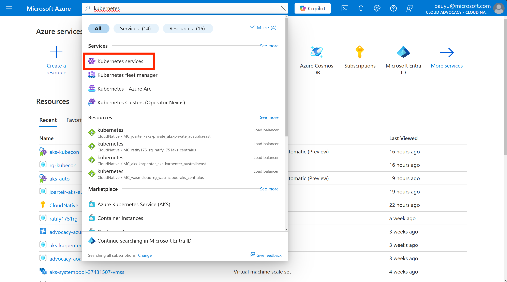

In the **Kubernetes services** screen, click on the **Create** drop down and then click on **Kubernetes cluster**.

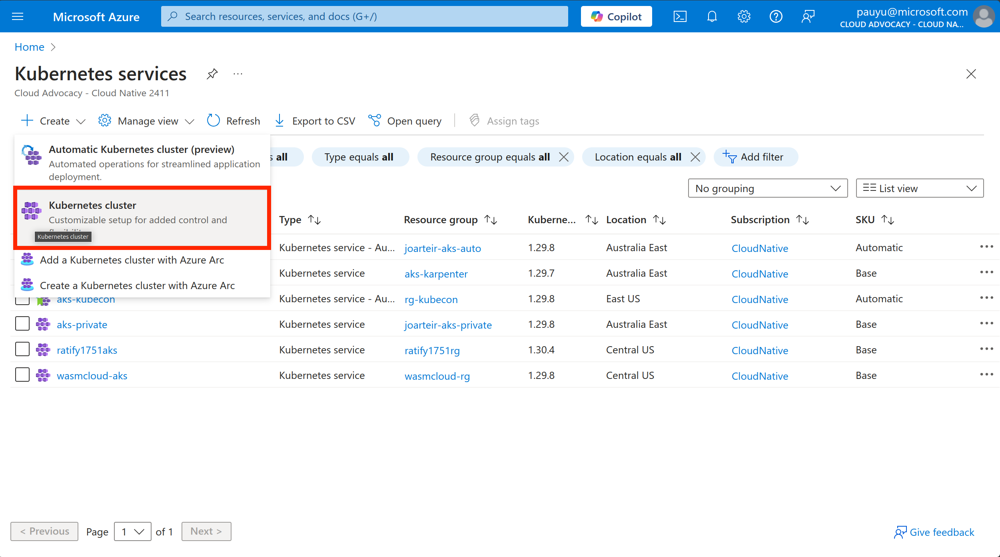

You should now see the **Create Kubernetes cluster** screen. This is where you can create a new AKS cluster.

Across the top of the screen, you'll notice a series of tabs. Under **Cluster details** in the **Basics** tab, you'll see the **Cluster preset configuration**. This is where you can choose from a series of presets that will automatically configure your AKS cluster based on your workload requirements.

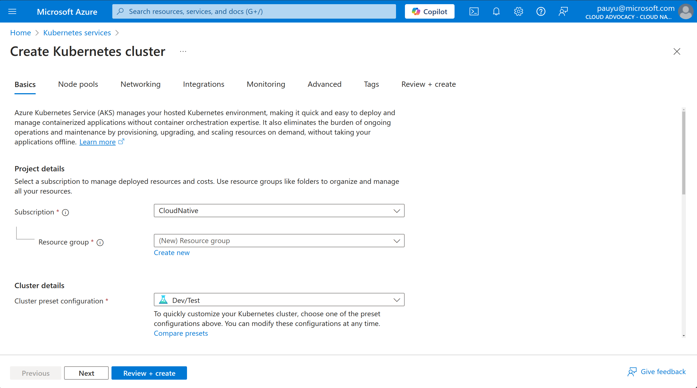

Click the **Compare presets** link to see the differences between the presets.

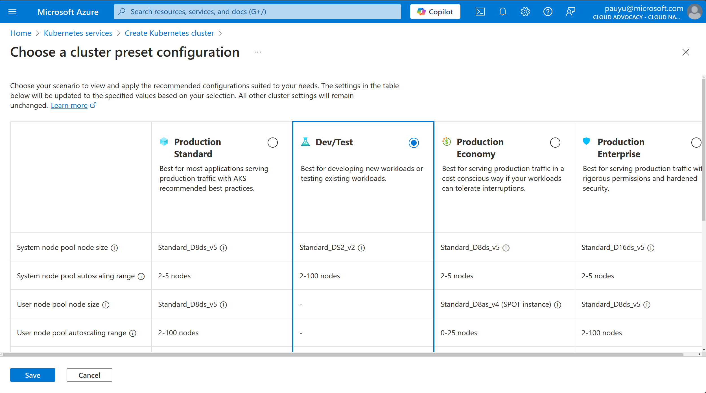

You should see a table that lists all the presets and the differences between them. By default, the **Production Standard** preset is selected.

Click **Cancel** to back out of the cluster preset comparison window.

You will also notice that the cluster preset can be selected from the drop down menu. Toggle between **Dev/Test** and **Production Enterprise** to see the differences between the presets.

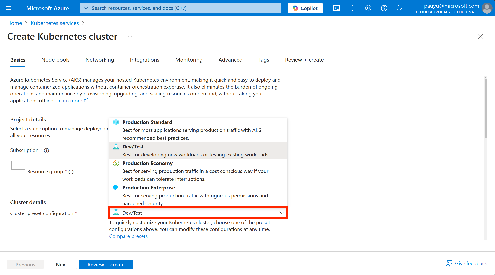

Going back to the tabs at the top of the screen, click through the **Node pools**, **Networking**, **Integrations**, **Monitoring**, and **Advanced** tabs to see additional configuration options available to you.

That's a lot of options! But what if you just want to create an AKS cluster without all the fuss? That's where **Automatic AKS Cluster** comes in.

Click the **X** icon in the upper right corner to back out of the create cluster window.

## Deploy AKS Automatic Cluster

Click on the **Create** drop down again but this time, click **Automatic Kubernetes cluster (preview)**.


You can see that the configuration options are much simpler. There's only a **Basics** and **Monitoring** tab.

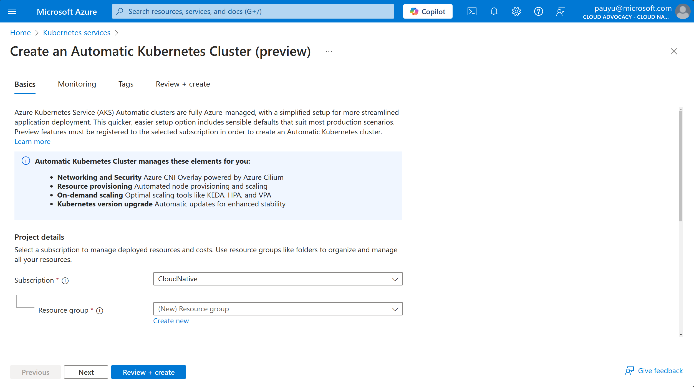

Let's go ahead and create an AKS automatic cluster.

In the **Basics** tab, fill out the following fields:

- **Subscription:** Select your Azure subscription.

  <div class="info" data-title="Note">

  > You may see a message that the subscription does not have the flags: EnableAPIServerVnetIntegrationPreview, NRGLockdownPreview, NodeAutoProvisioningPreview, DisableSSHPreview, SafeguardsPreview, AutomaticSKUPreview registered. Preview features must be registered in order to create a cluster so go ahead and click the **Register preview features** link to register the required flags in your subscription.

  </div>

- **Resource group:** Create a new resource group or use an existing one.
- **Kubernetes cluster name:** Enter a name for your cluster.
- **Region:** Select the desired region where you want to deploy your cluster.

  <div class="info" data-title="Note">

  > You need to ensure you have 32 vCPU quota for Standard_DSv2 available in the region you are deploying the cluster to. If you don't have enough quota, you can request a quota increase.

  </div>

- **Automatic upgrade scheduler:** Leave the default setting.
- **Access control:**: AKS Automatic uses Microsoft Entra ID authentication with Azure RBAC for cluster access. You can add additional users or groups to the cluster after it's created, but that is outside the scope of this workshop.

In the **Monitoring** tab, you have the option to either link existing monitoring resources or create new ones. We'll go ahead and create new monitoring resources.

- **Enable Container Logs:** Make sure the checkbox is checked to enable Container Insights.
- **Log Analytics Workspace:** Create the **Create new** link and create a new Log Analytics workspace.
- **Cost Preset:** Leave the default setting of **Standard**.
- **Enable Prometheus metrics:** Make sure the checkbox is checked to enable Prometheus metrics.
- **Azure Monitor workspace:** Create the **Create new** link and create a new Azure Monitor workspace.
- **Enable Grafana:** Make sure the checkbox is checked to enable Grafana.
- **Grafana workspace:** Create the **Create new** link and create a new Grafana workspace.
- **Enable recommended alerts:** Make sure the checkbox is checked to enable recommended alerts.

Click the **Review + create** button then after validation passes, click the **Create** button.

<div class="info" data-title="Note">

> The cluster creation process will take about 10-15 minutes to complete.

</div>

## Connect to AKS cluster

The kubectl tool is your direct line of communication with the kube-apiserver and is most common way to interact with a Kubernetes cluster. Access to the kube-apiserver is controlled by the [kubeconfig file](https://kubernetes.io/docs/concepts/configuration/organize-cluster-access-kubeconfig/). The kubeconfig file contains the necessary certificate information to authenticate against the Kubernetes API server, and the Azure CLI for AKS has a handy command to get the kubeconfig file for your AKS cluster.

<div class="info" data-title="Note">

> For the rest of this workshop, you will perform tasks using both kubectl and the Azure portal. This will give you a good understanding of how to interact with your AKS cluster using both methods. Any time we need to interact with the AKS cluster, we will use the Azure Cloud Shell. The Azure Cloud Shell is a free interactive shell that you can use to run the Azure CLI, kubectl, and other tools. It is already configured to use your Azure subscription and is a great way to run commands without having to install anything on your local machine.

</div>

In the Azure Portal, click the **Cloud Shell** icon in the top right corner of the portal.

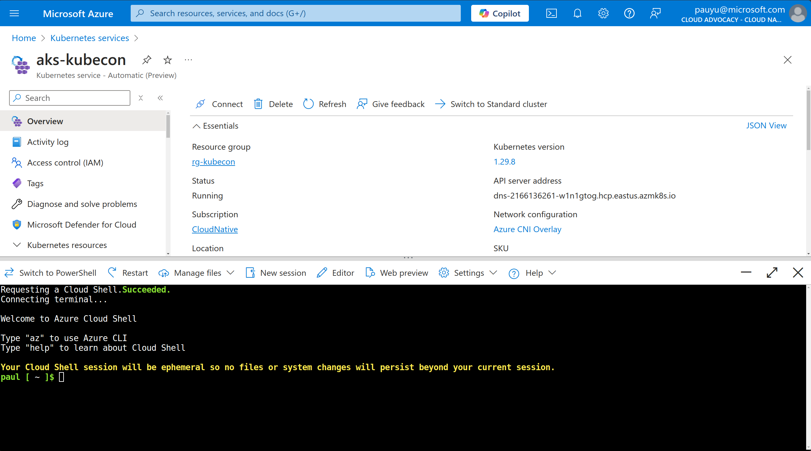

<div class="tip" data-title="Tip">

> If this is your first time opening Azure Cloud Shell, be sure to click the **Bash** button when asked presented with the environment selector as all command line instructions in this workshop are intended to be run in a POSIX shell. You may also be asked to create a storage account for your Cloud Shell. Go ahead and select **No storage account required**, then select your subscription and click **Apply**.

</div>

Run the following commands to set a few environment variables in a local .env file.

```bash
RG_NAME=<resource-group-name>
```

<div class="important" data-title="Important">

> Be sure to replace `<resource-group-name>` with the resource group name where the AKS cluster was deployed.

</div>

Run the following command to get the name of your AKS cluster.

```bash
AKS_NAME=$(az aks list -g $RG_NAME --query "[0].name" -o tsv)
```

Run the following command to write the environment variables to a local .env file.

```bash
echo "RG_NAME=$RG_NAME" > .env
echo "AKS_NAME=$AKS_NAME" >> .env
source .env
```

<div class="warning" data-title="Warning">

> Throughout the workshop, your Azure Cloud Shell session may time out. If this happens, you can simply refresh re-connect to the Azure Cloud Shell and run the `source .env` command to re-load the environment variables.

</div>

Run the following command to download the kubeconfig file for your AKS cluster.

```bash
az aks get-credentials --resource-group $RG_NAME --name $AKS_NAME
```

Now you should be able to run kubectl commands against your AKS cluster.

```bash
kubectl cluster-info
```

When running a kubectl command for the first time, you will be presented with a login prompt. Follow the instructions on the screen and proceed with the authorization process and the kubectl command will be executed. As your authentication token expires, you will be prompted to re-authenticate.

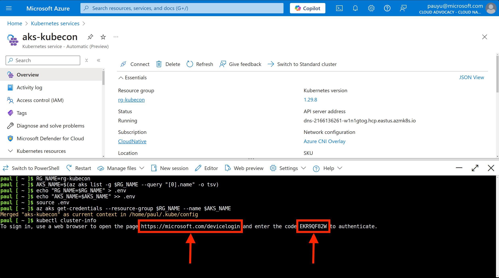

<div class="info" data-title="Note">

> AKS Automatic clusters are secured by default. It uses [Microsoft Entra ID](https://www.microsoft.com/security/business/identity-access/microsoft-entra-id) authentication with Azure RBAC for cluster access, so simply downloading the kubeconfig file is not enough to access the cluster. You also need to authenticate with Microsoft Entra ID and have the necessary permissions to access the cluster. When you created the AKS Automatic cluster, you were automatically granted the **Azure Kubernetes Service RBAC Cluster Admin** role assignment to access the cluster.

</div>

If you can see the cluster information printed in your terminal, your cluster is up and ready to host applications. But there is a little bit more prep work we need to do. We need to prepare the cluster for our application containers.

## Container Registries

Kubernetes is a container orchestrator. It will run whatever container image you tell it to run. Containers can be pulled from public container registries like [Docker Hub](https://hub.docker.com/) or [GitHub Container Registry (GHCR)](https://docs.github.com/en/packages/working-with-a-github-packages-registry/working-with-the-container-registry), or they can be pulled from private container registries like [Azure Container Registry (ACR)](https://azure.microsoft.com/products/container-registry). Pulling images from a public registry is fine for development and testing but for production workloads, you'll want to use a private registry and only deploy images that have been scanned for vulnerabilities and approved.

### Deploy Azure Container Registry (ACR)

ACR is a managed, private Docker registry service based on the open-source Docker Registry 2.0. It is highly available and scalable across Azure regions across the globe. It also integrates with Microsoft Entra ID for authentication and authorization so it makes it easy to secure your container images.

In the Azure Cloud Shell, run the following command to create an environment variable for your new Azure Container Registry name.

```bash
ACR_NAME=<acr-name>
echo "ACR_NAME=$ACR_NAME" >> .env
source .env
```

<div class="important" data-title="Important">

> Be sure to replace `<acr-name>` with a new unique name for your Azure Container Registry. The name for an ACR resource may contain alphanumeric characters only and must be between 5 and 50 characters long.

</div>

Run the following command to create a new Azure Container Registry.

```bash
az acr create --resource-group $RG_NAME --name $ACR_NAME --sku Basic
```

### Attach ACR to AKS cluster

With the Azure Container Registry created, you need to "attach" it to your AKS cluster. This will allow your AKS cluster to pull images from the Azure Container Registry by granting the AKS resource's managed identity the **AcrPull** role on the Azure Container Registry.

```bash
az aks update --name $AKS_NAME --resource-group $RG_NAME --attach-acr $ACR_NAME
```

## Import container images

We will be using a sample application called [aks-store-demo](https://github.com/Azure-Samples/aks-store-demo). This application is a simple e-commerce store that consists of three services: **store-front**, **order-service**, and **product-service**. The [store-front](https://github.com/Azure-Samples/aks-store-demo/tree/main/src/store-front) is a web application that allows users to browse products, add products to a cart, and checkout. The [product-service](https://github.com/Azure-Samples/aks-store-demo/tree/main/src/product-service) is a RESTful API that provides product information to the store-front service. Finally, the [order-service](https://github.com/Azure-Samples/aks-store-demo/tree/main/src/order-service) is a RESTful API that handles order processing and saves order to a [RabbitMQ](https://www.rabbitmq.com/) message queue.

Here is a high-level application architecture diagram:


The application containers are hosted on GitHub Container Registry (GHCR). Rather than building the containers from source, we will import the containers from GHCR to ACR.

In the Azure Cloud Shell, run the following commands to import the application container images to ACR.

```bash
# store-front version 1.2.0
az acr import --name $ACR_NAME --source ghcr.io/azure-samples/aks-store-demo/store-front:1.2.0 -t aks-store-demo/store-front:1.2.0 --no-wait

# store-front version 1.5.0
az acr import --name $ACR_NAME --source ghcr.io/azure-samples/aks-store-demo/store-front:1.5.0 -t aks-store-demo/store-front:1.5.0 --no-wait

# order-service
az acr import --name $ACR_NAME --source ghcr.io/azure-samples/aks-store-demo/order-service:1.2.0 -t aks-store-demo/order-service:1.2.0 --no-wait

# product-service
az acr import --name $ACR_NAME --source ghcr.io/azure-samples/aks-store-demo/product-service:1.2.0 -t aks-store-demo/product-service:1.2.0 --no-wait
```

<div class="info" data-title="Note">

> If you are wondering why we are importing two versions of the store-front application, it's because we will be rolling out application updates later in the workshop.

</div>

Run the following command to ensure the import operations have completed.

```bash
for repo in $(az acr repository list -n $ACR_NAME -o tsv); do
  echo "${repo} tags:"
  az acr repository show-tags -n $ACR_NAME --repository $repo
done
```

If you see tags for each repository, the import operations have completed.

---

# Deploy Store App to AKS

Let's continue in the Azure Cloud Shell and use kubectl to deploy the aks-store-demo application to AKS. There is a [YAML manifest](https://github.com/Azure-Samples/aks-store-demo/blob/main/aks-store-quickstart.yaml) in the repo that contains the deployment and service resources for the store-front, order-service, and product-service, and RabbitMQ.

## Updating Deployment manifests

Before we deploy the manifest, we need to make a few changes. The manifest in the repo references the images on GHCR. We need to replace the image references with the images we imported to ACR.

In the Azure Cloud Shell, run the following command to download the YAML file.

```bash
curl -o aks-store-quickstart.yaml https://raw.githubusercontent.com/Azure-Samples/aks-store-demo/main/aks-store-quickstart.yaml
```

Next, run the following **sed** command to replace all instances of `ghcr.io/azure-samples` with `${ACR_NAME}.azurecr.io` and the tag `latest` with `1.2.0` in the aks-store-quickstart.yaml file.

```bash
sed -i -e "s|ghcr.io/azure-samples/\(.*\):latest|${ACR_NAME}.azurecr.io/\1:1.2.0|g" aks-store-quickstart.yaml
```

Run the following command to apply the manifest.

```bash
kubectl apply -f aks-store-quickstart.yaml
```

<div class="info" data-title="Note">

> The deployment can take up to 10 minutes to schedule pods onto a new node. This is because the AKS Node Autoprovisioning feature (aka Karpenter) automatically provisions new nodes when the existing nodes are at capacity. The new nodes are provisioned with the necessary resources to run the pods. The pods are then scheduled onto the new nodes.

</div>

Run the following command to check the status of the pods.

```bash
kubectl get pods
```

When all the pods are in the **Running** state, you can proceed to the next step.

## Getting familiar with the demo app

Now, let's explore the store app. Run the following command to get the public IP address of the **store-front** service.

```bash
echo "http://$(kubectl get svc/store-front -o jsonpath='{.status.loadBalancer.ingress[0].ip}')"
```

Click the link in the terminal, and you should be taken to the product page of the AKS pet store. Here a user can browse products, add items to a shopping cart, and checkout. The checkout process is intentionally simple and does not require any payment information. The order is saved to a RabbitMQ message queue.

Add an item to the cart and checkout by clicking on the cart link in the upper right corner. You should see a confirmation message that the order was successfully placed.

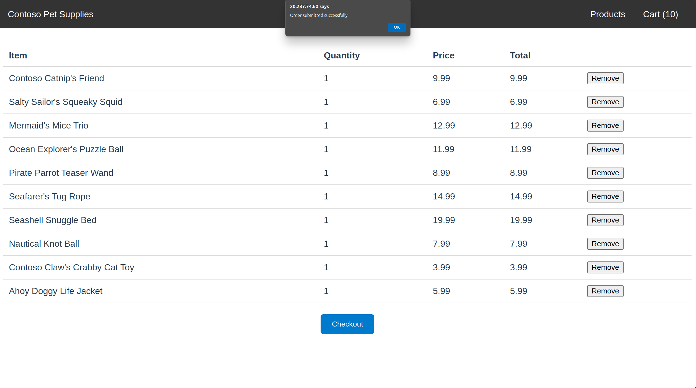

## Getting familiar with the Kubernetes resources

Now that we've seen the store app in action, let's take a closer look at the resources that were created when we applied the manifest to the Kubernetes cluster.

Run the following command to view the contents of the YAML file.

```bash
less aks-store-quickstart.yaml
```

<div class="tip" data-title="Tip">

> Press **up** or **down** arrow keys to scroll through the file. Press **q** to exit the file.

</div>

If you look at the YAML file, you'll see that it contains a [Deployment](https://kubernetes.io/docs/concepts/workloads/controllers/deployment/) and [Service](https://kubernetes.io/docs/concepts/services-networking/service/) resource for each of the three services: **store-front**, **product-service**, and **order-service**. It also contains a [StatefulSet](https://kubernetes.io/docs/concepts/workloads/controllers/statefulset/), Service, and [ConfigMap](https://kubernetes.io/docs/concepts/configuration/configmap/) resource for RabbitMQ.

The manifest is the desired state of the resources in the cluster. When you apply the manifest, the Kubernetes API server will create the resources in the cluster to match the desired state.

We can use the `kubectl get` command to view the resources that were created when we applied the manifest.

### Deployments

Each Deployment resource specifies the container image to use, the ports to expose, environment variables, and resource requests and limits. The Deployment resource was not originally part of Kubernetes but was introduced to make it easier to manage ReplicaSets. A ReplicaSet is a resource that ensures a specified number of pod replicas are running at any given time and no longer commonly used in favor of Deployments.

Run the following command to view the Deployments.

```bash
kubectl get deployments
```

You can see there are three deployments: order-service, product-service, and store-front. Each deployment has one replica. A deployment is a resource that manages a set of identical pods. The pods are created from the container image specified in the deployment resource.

If you want to see individual pods, you can run the following command.

```bash
kubectl get pods
```

This is where your application code runs. A pod is the smallest deployable unit in Kubernetes. It represents a single instance of a running process in your cluster. If you need to troubleshoot an application, you can view the logs of the pod.

```bash
kubectl logs <pod-name>
```

### Services

A Service is a resource that exposes an application running in a set of pods as a network service. It provides a stable endpoint for the application that can be accessed by other applications in the cluster or outside the cluster.

Run the following command to view the services.

```bash
kubectl get service store-front
```

As you can see, the **store-front** service is of type [LoadBalancer](https://kubernetes.io/docs/concepts/services-networking/service/#loadbalancer). This means that the Service is exposed to the internet and the Service has an pulbic IP address that you can use to access the application.

### StatefulSets

The StatefulSet is a resource that manages a set of identical pods with persistent storage and commonly used for stateful applications like databases and data stores.

Run the following command to view the StatefulSets.

```bash
kubectl get statefulsets
```

You can see that there is a StatefulSet for RabbitMQ. The StatefulSet resource is used to manage the RabbitMQ pods and ensure that the pods are created in a specific order.

### ConfigMaps

The ConfigMap resource is used to store configuration data in key-value pairs. The ConfigMap resource is used to store the configuration data for RabbitMQ.

Run the following command to view the ConfigMaps.

```bash
kubectl get configmaps
```

You can see that there is a ConfigMap for RabbitMQ. The ConfigMap resource is used to store the configuration data for RabbitMQ to enable AMQP 1.0 protocol.

## Ingress and App Routing Add-on

We saw that the service type for the **store-front** service is _LoadBalancer_. This is one way to expose an application to the internet. A better way is to use an [Ingress](https://kubernetes.io/docs/concepts/services-networking/ingress/). An [Ingress Controller](https://kubernetes.io/docs/concepts/services-networking/ingress-controllers/) is a Kubernetes resource that manages inbound access to services in a cluster. It provides HTTP and HTTPS routing to services based on hostnames and paths. The Ingress Controller is responsible for reading the Ingress resource and processing the rules to configure the load balancer. With AKS Automatic, the App Routing Add-on, a managed NGINX Ingress Controller, is enabled by default. All you need to do is create an Ingress resource and the App Routing Add-on will take care of the rest.

Let's convert our app to use ingress to expose the store-front service to the internet rather than using a public IP on the service.

Run the following command to patch the store-front service to change the service type to _ClusterIP_.

```bash
kubectl patch service store-front -p '{"spec": {"type": "ClusterIP"}}'
```

<div class="info" data-title="Note">

> kubectl is a powerful tool that can be used to create, update, and delete resources in a Kubernetes cluster. The `patch` command is used to update a resource in the cluster. The `-p` flag is used to specify the patch to apply to the resource. In this case, we are changing the service type to _ClusterIP_ to remove the public IP address from the service.

</div>

Run the following command to deploy the ingress manifest for the store-front app.

```bash
kubectl apply -f - <<EOF
apiVersion: networking.k8s.io/v1
kind: Ingress
metadata:
  name: store-front
spec:
  ingressClassName: webapprouting.kubernetes.azure.com
  rules:
  - http:
      paths:
      - path: /
        pathType: Prefix
        backend:
          service:
            name: store-front
            port:
              number: 80
EOF
```

This Ingress resource is very similar to a typical [NGINX Ingress](https://kubernetes.io/docs/concepts/services-networking/ingress/#the-ingress-resource) resource. The only difference is the `ingressClassName` field. The `ingressClassName` field is set to `webapprouting.kubernetes.azure.com` which enables the AKS App Routing Add-on to manage this resource.

Wait a minute or two for the ingress to be created, then run the following command to get the public IP address of the ingress.

```bash
echo "http://$(kubectl get ingress store-front -o jsonpath='{.status.loadBalancer.ingress[0].ip}')"
```

Click the URL in the terminal and you should be taken to the product page of the AKS pet store, this time using the Ingress to access the store-front service!

<div class="important" data-title="Important">

> It is also worth mentioning that the App Routing Add-on does a little more than just manage the NGINX Ingress Controller. It also provides integration with Azure DNS for automatic DNS registration and management and Azure Key Vault for automatic TLS certificate management. Check out the [App Routing Add-on documentation](https://learn.microsoft.com/azure/aks/app-routing?tabs=default%2Cdeploy-app-default) for more information.

</div>

---

# Application Resiliency

As mentioned above Kubernetes Deployments is a resource that manages [ReplicaSets](https://kubernetes.io/docs/concepts/workloads/controllers/replicaset/) and it enables you to manage application updates and rollbacks. This greatly improves the resiliency of your application.

## Deployments and ReplicaSets

There is a link between Deployment and ReplicaSet resources. When you create a Deployment, Kubernetes creates a ReplicaSet for you.

To view the link beetween the two resources, run the following command to get the owner reference of the store-front ReplicaSet.

```bash
# get the name of the store-front ReplicaSet
STORE_FRONT_RS_NAME=$(kubectl get rs --sort-by=.metadata.creationTimestamp | grep store-front | tail -n 1 | awk '{print $1}')

# get the details of the store-front ReplicaSet
kubectl get rs $STORE_FRONT_RS_NAME -o json | jq .metadata.ownerReferences
```

In the output, you can see the ReplicaSet resource is owned by the store-front Deployment resource. Also, note the `uid` field in the output. This is the unique identifier (`uid`) of the Deployment resource.

```json
[
  {
    "apiVersion": "apps/v1",
    "blockOwnerDeletion": true,
    "controller": true,
    "kind": "Deployment",
    "name": "store-front",
    "uid": "65aeeba4-5202-4fb7-9d70-ad5db0ffe1df"
  }
]
```

If we inspect at the Deployment resource, we can see the same `uid` field in the output.

```bash
kubectl get deployment store-front -o json | jq .metadata.uid
```

Additionally, when a Deployment is created, it creates a rollout history. You can view the rollout history by running the following command.

```bash
kubectl rollout history deployment store-front
```

Here you can see the revision number and you should only have a single revision since we only deployed the application once. Let's update the store-front app to use a new container image version and then roll back to the previous version.

## Deployment Update Strategy

The default deployment strategy of a Deployment resource is _RollingUpdate_. You can see that by running the following command.

```bash
kubectl get deployments store-front -o jsonpath='{.spec.strategy.type}'
```

The [RollingUpdate](https://kubernetes.io/docs/tutorials/kubernetes-basics/update/update-intro/) strategy means that Kubernetes will create a new ReplicaSet and scale it up while scaling down the old ReplicaSet. If the new ReplicaSet fails to start, Kubernetes will automatically roll back to the previous ReplicaSet.

Run the following command to update the store-front container image to use the 1.5.0 version.

```bash
kubectl set image deployment/store-front store-front=$ACR_NAME.azurecr.io/aks-store-demo/store-front:1.5.0
```

Run the following command to check the rollout status.

```bash
kubectl rollout status deployment/store-front
```

Wait until you see the message `deployment "store-front" successfully rolled out`.

Now if you run the following command, you should see two different versions of the ReplicaSet.

```bash
kubectl get rs --selector app=store-front
```

You should see the older ReplicaSet with 0 for the DESIRED, CURRENT, and READY columns and the newer ReplicaSet with 1s across the board.

If you browse to the store-front application, you should see the new version of the application.


### Rollback a Deployment

With Deployment rollouts, you can easily roll back to a previous version of the application. As mentioned earlier, the rollout history is stored and you can run the following command to roll back to the previous version.

```bash
kubectl rollout undo deployment/store-front
```

<div class="info" data-title="Note">

> You can also roll back to a specific revision by specifying the revision number. For example, `kubectl rollout undo deployment/store-front --to-revision=1` to select the first revision.

</div>

If you browse to the store-front application, you should see the previous version of the application.


## Dealing with Disruptions

As you may be aware, application updates can cause disruptions. However, with Kubernetes Deployments, you can manage application updates and rollbacks. But application updates are not the only disruptions that can occur. Nodes can fail or be marked for maintenance. You need to be prepared for both [voluntary and involuntary disruptions](https://kubernetes.io/docs/concepts/workloads/pods/disruptions/).

### Voluntary Disruptions

A voluntary disruption is a disruption that is initiated by the user. For example, you may want to scale down the number of replicas in a Deployment, or you may want to take a Node down for maintenance. Kubernetes has built-in mechanisms to handle these disruptions. During a voluntary disruption, Kubernetes will gracefully remove Pods from a Node.

In maintenance scenarios, a Node will be [drained and cordoned](https://kubernetes.io/docs/tasks/administer-cluster/safely-drain-node/) so that no new Pods will be scheduled on the node. Any existing Pod will be evicted using the [Eviction API](https://kubernetes.io/docs/concepts/scheduling-eviction/api-eviction/). It doesn't matter how many replicas you have running on a Node or how many replicas will be remaining after the eviction; the Pod will be evicted and rescheduled on another Node. This means you can incur downtime if you are not prepared for it.

Good news is that Kubernetes has a built-in mechanism to handle these disruptions. The [PodDisruptionBudget](https://kubernetes.io/docs/concepts/workloads/pods/disruptions/) resource allows you to specify the minimum number of Pods that must be available during a voluntary disruption. When a PodDisruptionBudget is created, Kubernetes will not evict Pods if evicting it will result in a violation of the budget. Essentially the PodDisruptionBudget ensures that a minimum number of Pods remains available during a voluntary disruption.

To see this in action we should scale our store-front deployment to have more than one replica. Run the following command to scale the store-front deployment to 3 replicas.

```bash
kubectl scale deployment store-front --replicas=3
```

With the deployment scaled to 3 replicas, we can see which nodes the Pods are running on.

```bash
kubectl get pod --selector app=store-front -o wide
```

You can see that the Pods are all running on a single Node.

Let's grab the name of the Node and cordon it.

```bash
# get the name of the Node
NODE_NAME=$(kubectl get pod -l app=store-front -o jsonpath='{.items[0].spec.nodeName}')

# cordon the node
kubectl drain $NODE_NAME --ignore-daemonsets
```

You should see a list of all the Pods that have been evicted. It doesn't matter that all 3 replicas of the store-front application were running on the node. Kubernetes doesn't care and will evict all the Pods with no regard.

This is where the PodDisruptionBudget comes in. A PodDisruptionBudget is a resource that specifies the minimum number of Pods that must be available during a voluntary disruption. When a PodDisruptionBudget is created, Kubernetes will not evict Pods that violate the budget

You will need to create a PodDisruptionBudget for the store-front application that specifies that at least 1 Pod must be available during a voluntary disruption. This will ensure that the next time we drain a node, at least 1 Pod will remain running. Once new Pods are scheduled on other nodes, the PodDisruptionBudget will be satisfied and the remaining Pods on the node will be evicted. This is a great way to ensure that your application remains available during a voluntary disruption.

Run the following command to create a PodDisruptionBudget for the store-front application.

```bash
kubectl apply -f - <<EOF
apiVersion: policy/v1
kind: PodDisruptionBudget
metadata:
  name: store-front-pdb
spec:
  minAvailable: 1
  selector:
    matchLabels:
      app: store-front
EOF
```

If you run the following command, you should see that the Pods were scheduled on a different node. If you see a status of 'Pending' wait a short while and re-run the command until all three replicas are in the 'Running' state.

```bash
kubectl get pod --selector app=store-front -o wide
```

<div class="info" data-title="Note">

> You may have noticed the drained Node is no longer available in your cluster. This is because the Node was unused and the [AKS Node Autoprovisioning](https://learn.microsoft.com/azure/aks/node-autoprovision?tabs=azure-cli) feature (aka [Karpenter](https://karpenter.sh/)) automatically removed it from the cluster. More on that later.

</div>

Let's drain the node again and see what happens.

```bash
# get the name of the new node
NODE_NAME=$(kubectl get pod -l app=store-front -o jsonpath='{.items[0].spec.nodeName}')

# cordon the new node
kubectl drain $NODE_NAME --ignore-daemonsets

# watch the status of the pods and the nodes they are running on
kubectl get pod --selector app=store-front -o wide -w
```

Notice this time a warning message is displayed that the PodDisruptionBudget is preventing the eviction of the a store-front Pod on the node due to the PodDisruptionBudget violation.

Once the new node is up and running, the PodDisruptionBudget will be satisfied and the remaining Pods on the node will be evicted.

### Involuntary Disruptions

An involuntary disruption is a disruption that is not initiated by the user. For example, a node may fail and if we had all the replicas of the store-front application running on that node, we would have downtime. When running more than one replica of an application, it is important to spread the replicas across multiple nodes to ensure high availability. This is where [PodAntiAffinity](https://kubernetes.io/docs/concepts/scheduling-eviction/assign-pod-node/#affinity-and-anti-affinity) or [PodTopologySpreadConstraints](https://kubernetes.io/docs/concepts/scheduling-eviction/topology-spread-constraints/) comes in.

**PodAntiAffinity** is a feature that allows you to specify that a Pod should not be scheduled on the same node as another Pod. PodAntiAffinity can be hard or soft. Hard PodAntiAffinity means that the Pods must be scheduled on different nodes. Soft PodAntiAffinity means that the Pods should be scheduled on different nodes if possible.

**PodTopologySpreadConstraints** is a feature that allows you to specify that a Pod should be spread across different zones, regions, or nodes. This is useful for ensuring high availability of your application.

Either of these Pod scheduling features can be used to ensure that your application remains available during an involuntary disruption with the difference being that PodAntiAffinity is used to spread Pods across nodes and PodTopologySpreadConstraints can provide more granular control by spreading Pods across zones and/or regions.

Let's ensure the store-front application is spread across multiple nodes. Run the following command to create a PodAntiAffinity rule for the store-front application.

Run the following command to get the YAML manifest for the store-front deployment.

```bash
kubectl get deployment store-front -o yaml > store-front-deployment.yaml
```

Open the `store-front-deployment.yaml` file using the nano text editor.

```bash
nano store-front-deployment.yaml
```

<div class="tip" data-title="Tip">

> When done editing, press the **Ctrl + O** keys to save the file then press the Enter key. Press the **Ctrl + X** keys to exit the nano text editor.

</div>

In the `store-front-deployment.yaml` file, add the following PodAntiAffinity rule to the `spec` section of the `store-front` deployment. This rule tells the Kubernetes scheduler to spread the store-front Pods using `topologyKey: kubernetes.io/hostname` which essentially means to spread the Pods across different nodes.

```yaml
affinity:
  podAntiAffinity:
    requiredDuringSchedulingIgnoredDuringExecution:
      - labelSelector:
          matchExpressions:
            - key: app
              operator: In
              values:
                - store-front
        topologyKey: "kubernetes.io/hostname"
```

<div class="warning" data-title="Warning">

> There are many `spec` items in the manifest, you want to add the code snippet above in the `spec` section that includes the `containers` field. Once you locate the correct `spec` section, add a new line after the `spec` field and just before the `containers` field and paste the code snippet.

</div>

Now let's replace the store-front deployment with the updated manifest.

```bash
kubectl replace -f store-front-deployment.yaml
```

This command will force Kubernetes to reschedule Pods onto new nodes. Run the following command to get the nodes that the store-front Pods are running on.

```bash
kubectl get pod --selector app=store-front -o wide -w
```

<div class="info" data-title="Note">

> It can take a few minutes for the Pods to be rescheduled onto new nodes because AKS Node Autoprovisioning (Karpenter) will need to create new nodes to satisfy the PodAntiAffinity rule.

</div>

Also note that the replacement of the Pods are considered to be an update to the Deployment resource. So the RollingUpdate strategy will be used to rollout new Pods before terminating the old Pods. So we're safe from downtime during this process!

Once the Pods are rescheduled onto new nodes, you should see that the Pods are spread across multiple nodes.

```bash
kubectl get pod --selector app=store-front -o wide
```

---

# Application and Cluster Scaling

In a enterprise production environment, the demands and resource useage of your workloads running on Azure Kubernetes Service (AKS) can be dynamic and change frequently. If your application requires more resources from the cluster, the cluster could be impacted due to the lack of resources. One of the easiest ways to ensure your applications have enough resources from the cluster, is to scale your cluster to include more working nodes.

There are two ways to accomplish adding more nodes to your AKS cluster. You can manually scale out your cluster, or you can configure cluster autoscaler to automatically adjust to the demands of your application and automatically scale the number of nodes for you. We'll look at how you can do each.

## Manually scaling your cluster

Manually scaling your cluster give you the ability to add or remove additional nodes to the cluster at any point in time. Using manual scaling is good for dev/test and/or small production environments where reacting to changing workload utilization is not that important. In most production environments, you will want to set policies based on conditions to scale your cluster in a more automated fashion. Manually scaling you cluster gives you the ability to scale your cluster at the exact time you want, but your applications could potentially be in a degraded and/or offline state while the cluster is scaling up.

<div class="task" data-title="Task">

> Open the terminal and run the following command to view and get the name of the AKS node pools

```bash
az aks show --resource-group myResourceGroup --name myAKSCluster --query agentPoolProfiles
```

The following is a condensed example output from the previous command. We're focused on getting the name property from the output. The output should look similar to:

```bash
[
  {
    "count": 3,
    "maxPods": 250,
    "name": "systempool",
    "osDiskSizeGb": 30,
    "osType": "Linux",
    "vmSize": "Standard_DS2_v2"
  }
]
```

Using the previous output name property, we will now scale the cluster up.

<div class="task" data-title="Task">

> Scale the cluster up by adding one additional node

```bash
az aks scale --resource-group myResourceGroup --name myAKSCluster --node-count 4 --nodepool-name <your node pool name>
```

Scaling will take a few moments. You should see the scaling activity running in your terminal.

```bash
 | Running ..
```

Once the scaling up is complete, you should see something similar as the completion output below:

```bash
{
  "aadProfile": null,
  "addonProfiles": null,
  "agentPoolProfiles": [
    {
      "count": 4,
      "maxPods": 250,
      "name": "systempool",
      "osDiskSizeGb": 30,
      "osType": "Linux",
      "vmSize": "Standard_DS2_v2",
      "vnetSubnetId": null
    }
  ],
  [...]
}
```

Notice the count property increased.

We will now manually scale the cluster down by one node.

<div class="task" data-title="Task">

> Scale the cluster down by removing one additional node

```bash
az aks scale --resource-group myResourceGroup --name myAKSCluster --node-count 3 --nodepool-name <your node pool name>
```

## HPA

> https://kubernetes.io/docs/tasks/run-application/horizontal-pod-autoscale-walkthrough/

```bash
kubectl run -i --tty load-generator --rm --image=busybox:1.28 --restart=Never -- /bin/sh -c "while sleep 0.01; do wget -q -O- http://store-front; done"
```

see it reach 100% CPU

```bash
kubectl top pod -l app=store-front
```

Add an HPA to the store-front deployment:

```bash
kubectl autoscale deployment store-front --cpu-percent=50 --min=1 --max=100
```

Check the HPA:

```bash
kubectl get hpa store-front
```

Generate load on the store-front service

## Scaling with KEDA based on CPU utilization

You could just stick with HPA but you'd need to constantly monitor and adjust the CPU threshold.

KEDA is a Kubernetes-based Event Driven Autoscaler. With KEDA, you can automate the scaling of your application and it can scale on more than just CPU. It can scale based on the number of events in a queue, or the length of a stream, or the number of messages in a topic.

AKS Automatic Cluster comes with KEDA pre-installed.

Use Azure Portal to create a new ScaledObject

Run load generator again, and see it in action.

---

# Handling Stateful Workloads

Container storage is ephemeral; that is if a pod is deleted, the data is lost because by default, data is saved within the container. In order to persist the data, you need to use [Persistent Volume (PV)](https://kubernetes.io/docs/concepts/storage/persistent-volumes/) and [Persistent Volume Claim (PVC)](https://kubernetes.io/docs/concepts/storage/persistent-volumes/#persistentvolumeclaims).

## AKS Storage classes and PVC's

Typically for persistent storage in a Kubernetes cluster, you would create a PV to allocate storage and use a PVC to request a slice storage against the PV.

With AKS, [Azure CSI drivers and storage classes](https://learn.microsoft.com/azure/aks/csi-storage-drivers) are pre-deployed into your cluster. The storage classes allow you to simply create a PVC that references a particular storage class based on your application requirements. This storage class will take care of the task of creating the PV for you, in this case, using Azure Storage. So AKS removes the need to manually create PV's.

Run the following command to get the list of storage classes in your AKS cluster.

```bash
kubectl get storageclasses
```

We need to update the RabbitMQ StatefulSet to use a PVC. Run the following command to get the YAML manifest for the RabbitMQ StatefulSet.

```bash
kubectl get statefulset rabbitmq -o yaml > rabbitmq-statefulset.yaml
```

Open the `rabbitmq-statefulset.yaml` file using the nano text editor.

```bash
nano rabbitmq-statefulset.yaml
```

Add the following PVC spec to the `rabbitmq-statefulset.yaml` file. This will create a PVC that requests 1Gi of storage using the `managed-csi` storage class.

```yaml
volumeClaimTemplates:
  - metadata:
      name: rabbitmq-data
    spec:
      storageClassName: managed-csi
      accessModes:
        - ReadWriteOnce
      resources:
        requests:
          storage: 1Gi
```

<div class="warning" data-title="Warning">

> There are many `spec` items in the manifest, you want to add the code snippet at the top of the first `spec` section

</div>

Keep the file open, navigate to the pod template spec and add an additional volume that references the PVC.

```yaml
- name: rabbitmq-data
  persistentVolumeClaim:
    claimName: rabbitmq-data
```

Finally in the container spec, add a volume mount that references the volume.

```yaml
- mountPath: /var/lib/rabbitmq/mnesia
  name: rabbitmq-data
```

Save the file and exit the nano text editor.

<div class="info" data-title="Info">

> For more information on RabbitMQ and persistent storage, see the [RabbitMQ documentation](https://www.rabbitmq.com/docs/relocate) and this [blog post](https://www.rabbitmq.com/blog/2020/08/10/deploying-rabbitmq-to-kubernetes-whats-involved).

</div>

Run the following command to replace the RabbitMQ StatefulSet with the updated manifest.

```bash
kubectl delete statefulset rabbitmq
kubectl apply -f rabbitmq-statefulset.yaml
```

A `volumeClaimTemplates` section was added to the RabbitMQ StatefulSet manifest. This section defines a PVC that requests 1Gi of storage using the `managed-csi` storage class. The PVC is automatically created by the storage class and is bound to an Azure Disk.

You can check the status of the PVC by running the following command.

```bash
kubectl get pvc
```

If you see STATUS as `Bound`, the PVC has been successfully created and is ready to be used by the RabbitMQ pod. You can also see that the Azure Disk has been created in the AKS cluster's managed resource group by running the following command.

```bash
az resource list \
  -g $(az aks show --name $AKS_NAME --resource-group $RG_NAME --query nodeResourceGroup -o tsv) \
  --resource-type Microsoft.Compute/disks \
  --query "[?contains(name, 'pvc')]" \
  -o table
```

Now, let's test the durability of the RabbitMQ data by creating a queue and then deleting the RabbitMQ pod. Run the following command to port-forward to the RabbitMQ management UI.

```bash
kubectl port-forward svc/rabbitmq 15672:15672
```

Open a browser and navigate to `http://localhost:15672`. Log in with the username `username` and password `password`. Click on the **Queues** tab then click on **Add a new queue** and create a new queue called `test`.

<div class="info" data-title="Note">

> Make sure the **Durability** option is set to **Durable**. This will ensure that the queue is persisted to disk.

</div>

Back in the terminal, run the following command to delete the RabbitMQ pod.

```bash
kubectl delete pod rabbitmq-0
```

After a few seconds, Kubernetes will do what it does best and recreate the RabbitMQ pod. At this point the port-forward to the RabbitMQ service will be broken, so run the port-forward command again and reload the RabbitMQ management UI in the browser. Navigate back to the **Queues** tab and you should see the `test` queue you created earlier. This is because the we mounted the Azure Disk to the `/var/lib/rabbitmq/mnesia` path and all RabbitMQ data now persists across pod restarts.

## Replace RabbitMQ with Azure Service Bus

As you can see, Kubernetes is great for stateless applications especially with Azure storage backing it. But running stateful applications like RabbitMQ in a highly available and durable way can be challenging and might not be something you would want to manage yourself. This is where integrating with a managed service like [Azure Service Bus](https://learn.microsoft.com/azure/service-bus-messaging/service-bus-messaging-overview) can help. Azure Service Bus is a fully managed enterprise message broker with message queues and publish-subscribe topics very similar to RabbitMQ. The sample application has been written to use the AMQP protocol which is supported by both RabbitMQ and Azure Service Bus, so we can easily switch between the two.

### Create Azure Service Bus namespace and queue

In the Azure portal, search for **Service Bus**, click on **Service Bus** under **Services** then click on the **Create service bus namespace** button.

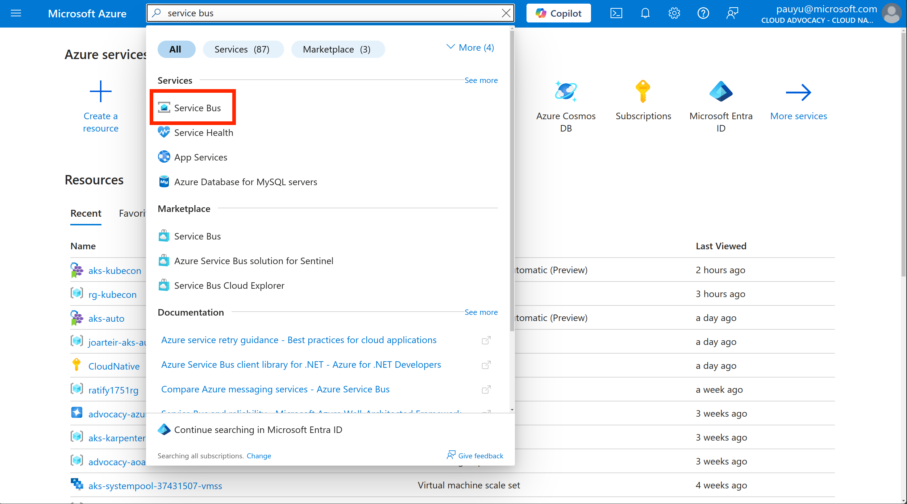

Fill in the required fields and click **Create**.

- **Resource group**: Select the resource group where your AKS cluster is deployed.
- **Namespace name**: Enter a unique name for the namespace (should be globally unique and lower case).
- **Location**: Select the same location as your AKS cluster.
- **Pricing tier**: Select **Basic**.

Click on the **Review + create** button then click **Create**.

Once the namespace is created, click on the **Go to resource** button.

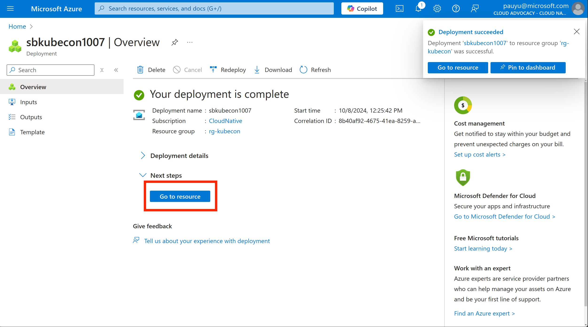

In the **Overview** section, click on the **+ Queue** button at the top to create a new queue.


In the **Create queue** window, set the name of the queue to `orders` and click **Create**.


### Create a user-assigned managed identity

In order for the order-service application to authenticate with Azure Service Bus, we need to create a user-assigned managed identity. In the Azure portal, search for **Managed Identities**, click on **Managed Identities** under **Services** then click on the **+ Create** button.

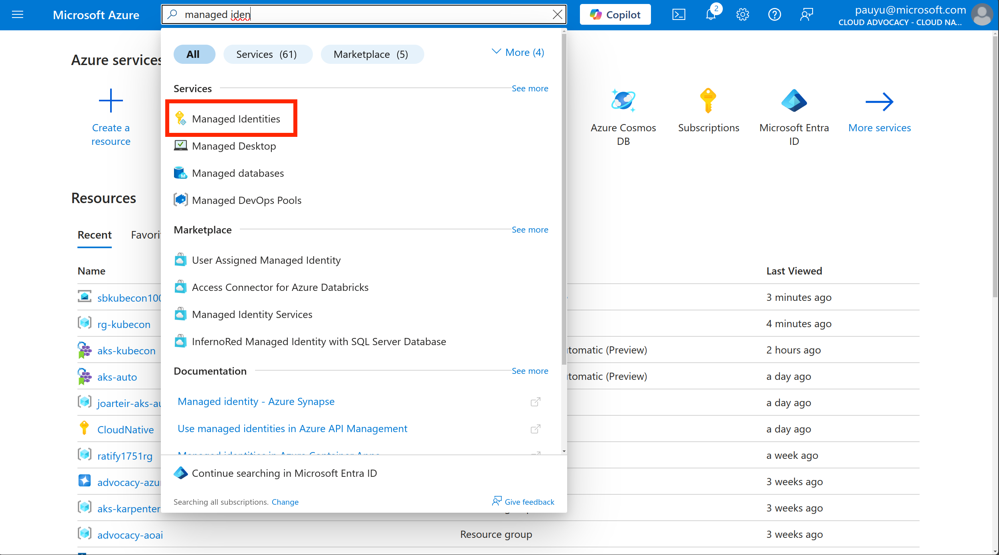

Fill in the required fields

- **Resource group**: Select the resource group where your AKS cluster is deployed.
- **Name**: You can use the same name as the Service Bus namespace.

Click **Review + create** then click **Create**.

### Integrate Azure Services with AKS using Service Connector

Here is where the authentication magic happens. We will use the [AKS Service Connector](https://learn.microsoft.com/azure/service-connector/overview) to connect the order-service application to Azure Service Bus. The AKS Service Connector is a new feature that greatly simplifies the process of configuring [Workload Identity](https://learn.microsoft.com/azure/aks/workload-identity-overview?tabs=dotnet) for your applications running on AKS. [Workload Identity](https://learn.microsoft.com/entra/workload-id/workload-identities-overview) is a feature that allows you to assign an identity to a Pod and use that identity to authenticate with Microsoft Entra ID to access Azure services.

<div class="info" data-title="Note">

> Workload Identity is the recommended way to authenticate with Azure services from your applications running on AKS. It is more secure than using service principals and does not require you to manage credentials in your application. To read more about the implementation of Workload Identity for Kubernetes, see [this doc](https://azure.github.io/azure-workload-identity/docs/).

</div>

In the Azure portal, navigate to the AKS cluster you created earlier. In the left-hand menu, click on **Service Connector (Preview)** under **Settings** then click on the **+ Create** button.


In the **Basics** tab, enter the following details:

- **Kubernetes namespace**: Enter **default**
- **Service type**: Select **Service Bus**

Leave the rest of the fields as their default values and click **Next: Authentication**.

In the **Authentication** tab, select the **Workload Identity** option and select the user-assigned managed identity you created earlier.

Click **Next: Networking** then click **Next: Review + create** and finally click **Create**.

<div class="info" data-title="Info">

> This process will take a few minutes as the Service Connector does some work behind the scenes to configure Workload Identity for the order-service application. Some of the tasks include assigning the proper Azure role permissions to the [managed identity](https://learn.microsoft.com/entra/identity/managed-identities-azure-resources/overview) to access the Service Bus, creating a [Federated Credential](https://learn.microsoft.com/entra/workload-id/workload-identity-federation) to establish trust between the Kubernetes cluster and the managed identity, creating a Kubernetes [ServiceAccount](https://kubernetes.io/docs/concepts/security/service-accounts/) with a link back to the managed identity, and finally creating a Kubernetes [Secret](https://kubernetes.io/docs/concepts/configuration/secret/) with the Service Bus endpoint information.

</div>

Once the Service Connector for Azure Service Bus has been created, you can configure the order-service application to use the Service Bus connection details.

In the Service Connector page, select the checkbox next to the Service Bus connection and click the **Yaml snippet** button.

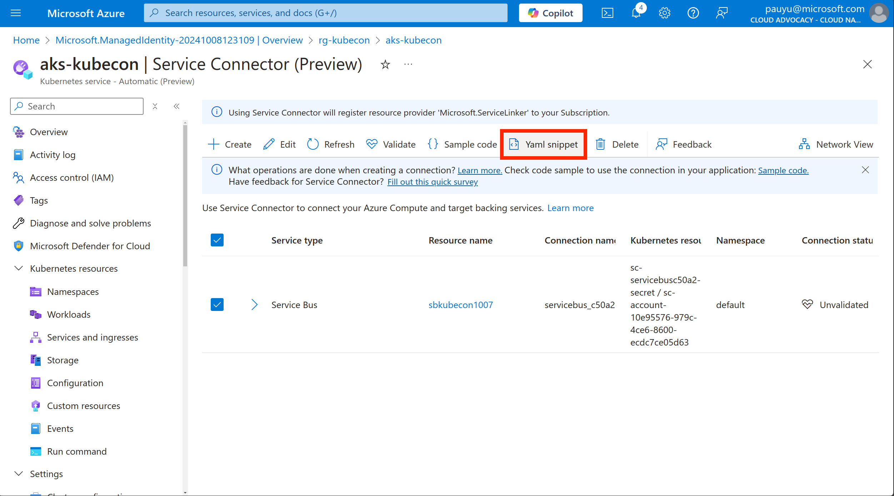

In the **YAML snippet** window, select **Kubernetes Workload** for **Resource type**, then select **order-service** for **Kubernetes Workload**.


You will see the YAML manifest for the order-service application with the highlighted edits required to connect to Azure Service Bus via Workload Identity.

Click **Apply** to apply the changes to the order-service application. This will redeploy the order-service application with the new connection details. But since the original order-service deployment was created specifically to connect to RabbitMQ, we need to update the deployment to remove some of the RabbitMQ specific information.

The order-service is designed to use multiple authentication methods. We need to add one environment variable to the order-service deployment to tell it to connect to the Azure Service Bus using workload identity.

Run the following command to patch the order-service deployment.

```bash
# add the USE_WORKLOAD_IDENTITY_AUTH environment variable
kubectl patch deployment order-service --type='json' -p='[
  {
    "op": "add",
    "path": "/spec/template/spec/containers/0/env/-",
    "value": {
      "name": "USE_WORKLOAD_IDENTITY_AUTH",
      "value": "true"
    }
  }
]'

# remove the RabbitMQ specific environment variables
kubectl patch deployment order-service --type='json' -p='[
  { "op": "remove", "path": "/spec/template/spec/containers/0/env/3" },
  { "op": "remove", "path": "/spec/template/spec/containers/0/env/2" },
  { "op": "remove", "path": "/spec/template/spec/containers/0/env/1" },
  { "op": "remove", "path": "/spec/template/spec/containers/0/env/0" }
]'

# remove the RabbitMQ init container
kubectl patch deployment order-service --type='json' -p='[
  { "op": "remove", "path": "/spec/template/spec/initContainers" }
]'
```

<div class="info" data-title="Info">

> The `USE_WORKLOAD_IDENTITY_AUTH` environment variable is used to tell the order-service application to use Workload Identity to authenticate with Azure Service Bus. The other environment variables are removed because they are specific to RabbitMQ.

</div>

With Azure Service Bus in place, RabbitMQ isn't needed anymore, so run the following commands to delete it.

```bash
kubectl delete statefulset rabbitmq
kubectl delete service rabbitmq
```

Browse to the store-front application again, add an item to the cart, and checkout, you should see the order appear in the Azure Service Bus queue. To view the message in the queue, you can use the Azure portal or the Azure CLI.

```bash
# get the service bus namespace name
SERVICEBUS_NAME=$(az servicebus namespace list -g $RG_NAME --query "[0].name" -o tsv)

# get the active message count in the orders queue
az servicebus queue show --resource-group $RG_NAME --namespace-name $SERVICEBUS_NAME --name orders --query "countDetails"
```

You should see 1 active message count in the queue.

---

# Observability

Monitoring and observability are key components of running applications in production. With AKS Automatic, you get a lot of monitoring and observability features enabled out-of-the-box. If you recall from the beginning of the workshop, we created an [Azure Log Analytics Workspace](https://learn.microsoft.com/azure/azure-monitor/logs/log-analytics-overview) with [Container Insights](https://learn.microsoft.com/azure/azure-monitor/containers/container-insights-overview) to collect application logs, [Azure Monitor Managed Workspace](https://learn.microsoft.com/azure/azure-monitor/containers/kubernetes-monitoring-enable?tabs=cli) to with [Prometheus recording rules](https://learn.microsoft.com/azure/azure-monitor/containers/prometheus-metrics-scrape-default) enabled to capture metrics from workloads within the cluster, and [Azure Managed Grafana](https://azure.microsoft.com/products/managed-grafana) to visualize the metrics.

## Cluster observability

In the Azure portal, navigate to the AKS cluster you created earlier. In the left-hand menu, scroll down to the **Monitoring** section and click on **Insights**. Here you can see a high-level overview of how the cluster is performing.


The AKS Automatic cluster was also pre-configured with basic CPU utilization and memory utilization alerts. You can also create additional alerts based on the metrics collected by the Prometheus workspace.

Click on the **Recommended alerts (Preview)** button to view the recommended alerts for the cluster. Expand the **Prometheus community alert rules (Preview)** section to see the list of Prometheus alert rules that are available. You can enable any of these alerts by clicking on the toggle switch.

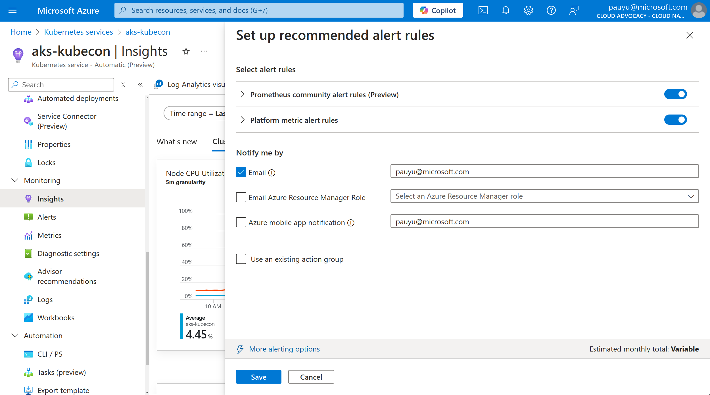

Click save to enable the alerts.

## Workbooks and logs

With Container Insights enabled, you can query the logs using Kusto Query Language (KQL) and create custom workbooks to visualize the data. One nice feature of Container Insights is having pre-configured workbooks that you can use to monitor your cluster and applications without having to write any queries.

In the **Monitoring** section of the AKS cluster left-hand menu, click on **Workbooks**. Here you will see a list of pre-configured workbooks that you can use to monitor your cluster.


One workbook that is particularly useful is the **Cluster Optimization** workbook. This workbook can help you identify anomalies and detect application probe failures in additon to providing guidance on optimizing container resource requests and limits. Click on the **Cluster Optimization** workbook to view the details.


Take some time to explore the other workbooks available in the list.

<div class="tip" data-title="Tip">

> The workbook visuals will include a query button that you can click to view the KQL query that powers the visual. This is a great way to learn how to write your own queries.

</div>

If you click on the **Logs** section in the left-hand menu, you can view the logs collected by Container Insights. Here, you can write your own KQL queries or run pre-configured queries to logs from your cluster and applications. If you expand the **Logs** menu, click on **Queries**, and scroll down to the **Container Logs** section, you will see a list of pre-configured queries that you can run. Click on a query and click **Run** to view the results.

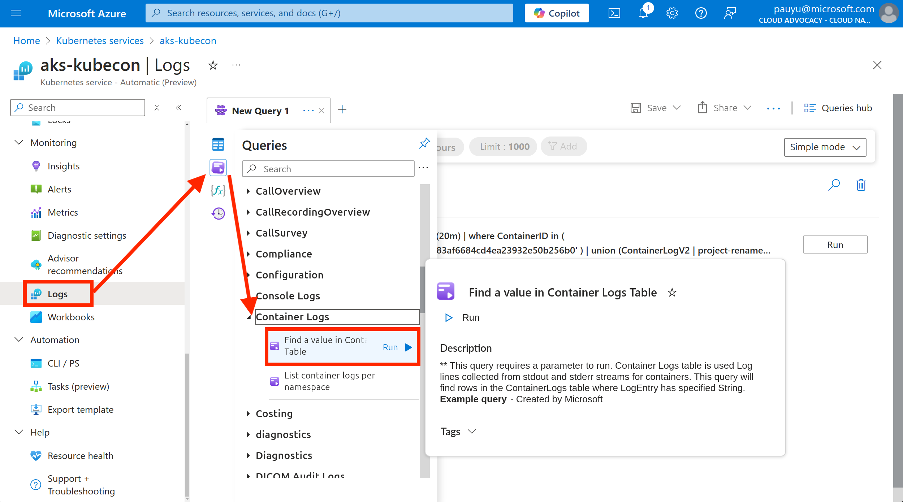

You can also view live streaming logs for a specific container by clicking on the **Workloads** section in the left-hand menu. In the **Deployments** tab, scroll down and locate the **order-service** deployment. Click on the **order-service** deployment to view the details. In the left-hand menu, click on **Live logs**, then select the Pod you want to view logs for.


This is the equivalent of running `kubectl logs -f <pod-name>` in the terminal.

## Visualizing metrics with Grafana

The Azure Portal provides a great way to view metrics and logs, but if you prefer to visualize the data using Grafana, or execute complex queries using PromQL, you can use the Azure Managed Grafana instance that was created with the AKS Automatic cluster.

In the AKS cluster's left-hand menu, click on **Insights** under the **Monitoring** section and click on the **View Grafana** button at the top of the page. This will open a window with the linked Azure Managed Grafana instance. Click on the **Browse dashboards** link. This will take you to the Azure Managed Grafana instance.


In the Grafana home page, click on the **Dashboards** link in the left-hand menu. Here you will see a list of pre-configured dashboards that you can use to visualize the metrics collected by the Prometheus workspace.


In the **Dashboards** list, expand the **Azure Managed Prometheus** folder and explore the dashboards available.

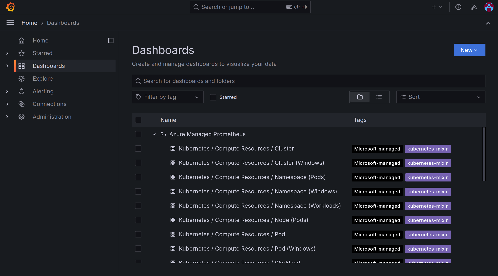

Each dashboard provides a different view of the metrics collected by the Prometheus workspace with controls to allow you to filter the data.

Click on a **Kubernetes / Compute Resources / Workload** dashboard. Filter the **namespace** to `default` the **type** to `deployment`, and the **workload** to `order-service`. This will show you the metrics for the order-service deployment.


## Querying metrics with PromQL

If you prefer to write your own queries to visualize the data, you can use the **Explore** feature in Grafana. In the Grafana home page, click on the **Explore** link in the left-hand menu, and select the **Managed_Prometheus_defaultazuremonitorworkspace** data source.

The query editor supports a graphical query builder and a text-based query editor. The graphical query builder is a great way to get started with PromQL. You can select the metric you want to query, the aggregation function, and any filters you want to apply.


## Importing dashboards

If none of the pre-configured dashboards meet your needs, you can import a dashboard from the [Grafana community](https://grafana.com/grafana/dashboards/?search=azure). In fact, many of the pre-configured Azure dashboards were imported from the Grafana community for you when the Azure Managed Grafana instance was created.

To import a dashboard, navigate to the **Dashboards** page in Grafana, click on the **New** button, then click on **Import**.

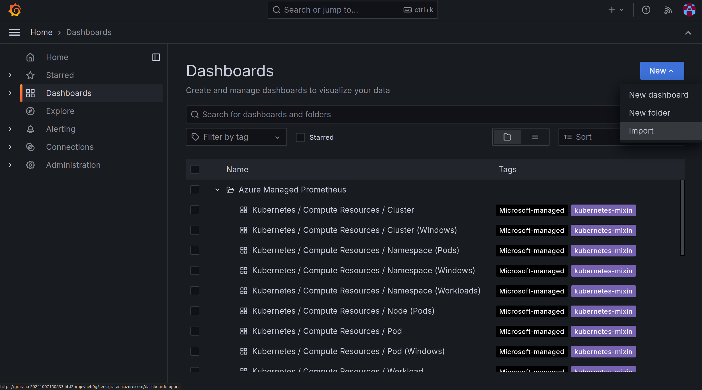

You can import a dashboard by providing the dashboard ID or by uploading a JSON file. To import a dashboard from the Grafana community, you will need to provide the dashboard ID. For example, the dashboard ID for the [Kubernetes / ETCD](https://grafana.com/grafana/dashboards/20330-kubernetes-etcd/) dashboard is `20330`.

<div class="info" data-title="Note">

> The **Kubernetes / ETCD dashboard** allows you to monitor the AKS control plane components. In order to see data in this dashboard, you will need to have the `AzureMonitorMetricsControlPlanePreview` feature enabled in your Azure subscription prior to creating your AKS cluster. See the [documentation](https://learn.microsoft.com/en-us/azure/aks/monitor-aks) for more information.

</div>

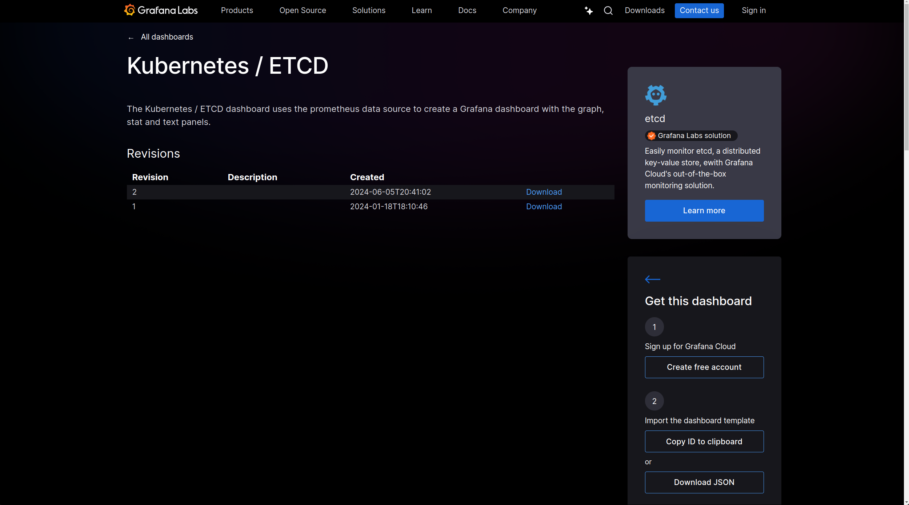

Simply copy the dashboard ID, paste it into the **Grafana.com dashboard URL or ID** field, and click **Load**. This will import the dashboard into your Azure Managed Grafana instance.

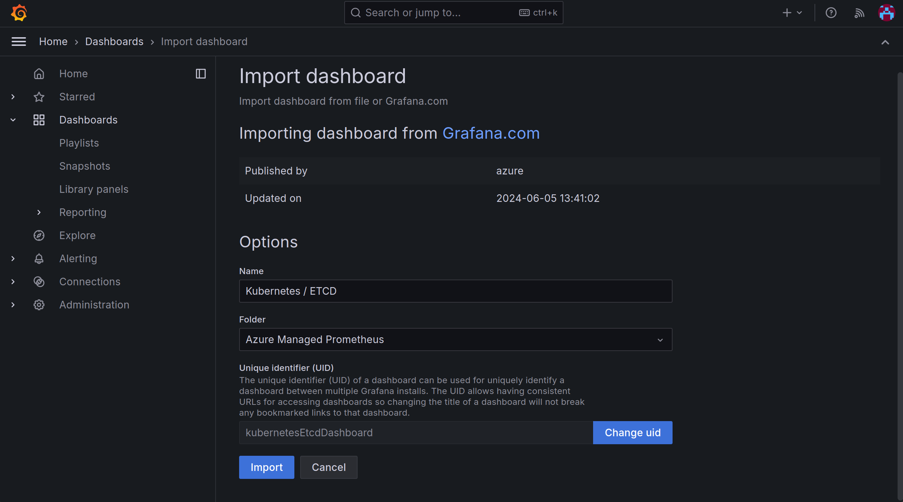

<div class="tip" data-title="Tip">

> To view the full list of dashboards available in the Grafana community written by the Azure team, visit the [Azure Grafana dashboards](https://grafana.com/orgs/azure) page.

</div>

---

# CI/CD and Automated Deployments

## Use AKS Automated Deployments with a single service to setup CI/CD

---

# Summary

In this workshop, you learned how to create an AKS cluster with the new AKS Automatic feature. You deployed a sample application to the cluster and explored some of the features that AKS Automatic provides. You learned how to scale your cluster manually and automatically using the Horizontal Pod Autoscaler and KEDA. You also learned how to handle stateful workloads using Persistent Volumes and Azure Service Bus. Finally, you explored the monitoring and observability features of AKS Automatic.

To learn more about AKS Automatic, visit the [AKS documentation](https://learn.microsoft.com/azure/aks/intro-aks-automatic).

In addition to this workshop, you can also explore the following resources:

- [Azure Kubernetes Service (AKS) documentation](https://learn.microsoft.com/azure/aks)
- [Kubernetes: Getting started](https://azure.microsoft.com/solutions/kubernetes-on-azure/get-started/)
- [Learning Path: Introduction to Kubernetes on Azure](https://learn.microsoft.com/training/paths/intro-to-kubernetes-on-azure/)
- [Learning Path: Deploy containers by using Azure Kubernetes Service (AKS)](https://learn.microsoft.com/training/paths/deploy-manage-containers-azure-kubernetes-service/)

If you have any feedback or suggestions for this workshop, please feel free to open an issue or pull request in the [GitHub repository](https://github.com/Azure-Samples/aks-labs)
